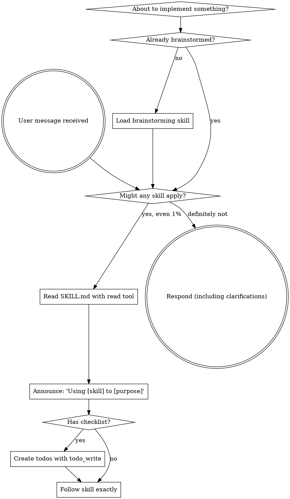

<EXTREMELY-IMPORTANT>
If you think there is even a 1% chance a skill might apply to what you are doing, you ABSOLUTELY MUST load and follow the skill.

IF A SKILL APPLIES TO YOUR TASK, YOU DO NOT HAVE A CHOICE. YOU MUST USE IT.

This is not negotiable. This is not optional. You cannot rationalize your way out of this.
</EXTREMELY-IMPORTANT>

## How to Access Skills (pi tool mapping)

**In pi:** Skills are listed in the system prompt with their file paths. Use the `read` tool to load a skill's full SKILL.md content. The path is shown in the `<available_skills>` block in the system prompt.

**Tool mapping from OpenCode/Claude Code references in skill content:**

| Skill mentions | pi equivalent |
|---|---|
| `Skill` tool | `read` the SKILL.md path shown in `<available_skills>` |
| `TodoWrite` | `todo_write` tool |
| `Task(...)` subagent dispatch | `subagent` tool |
| `superpowers:skill-name` | read the SKILL.md for that skill |

# Using Skills

## The Rule

**Load relevant or requested skills BEFORE any response or action.** Even a 1% chance a skill might apply means you should load the skill to check. If a loaded skill turns out to be wrong for the situation, you don't need to follow it.



## Red Flags

These thoughts mean STOP—you're rationalizing:

| Thought | Reality |
|---------|---------|
| "This is just a simple question" | Questions are tasks. Check for skills. |
| "I need more context first" | Skill check comes BEFORE clarifying questions. |
| "Let me explore the codebase first" | Skills tell you HOW to explore. Check first. |
| "I can check git/files quickly" | Files lack conversation context. Check for skills. |
| "This doesn't need a formal skill" | If a skill exists, use it. |
| "I remember this skill" | Skills evolve. Read current version. |
| "This doesn't count as a task" | Action = task. Check for skills. |
| "The skill is overkill" | Simple things become complex. Use it. |
| "I'll just do this one thing first" | Check BEFORE doing anything. |

## Skill Priority

When multiple skills could apply, use this order:

1. **Process skills first** (brainstorming, debugging) - these determine HOW to approach the task
2. **Implementation skills second** - these guide execution

"Let's build X" → brainstorming first, then implementation skills.
"Fix this bug" → systematic-debugging first, then domain-specific skills.

## Skill Types

**Rigid** (test-driven-development, systematic-debugging): Follow exactly. Don't adapt away discipline.

**Flexible** (patterns): Adapt principles to context.

The skill itself tells you which.

## Updating Superpowers

```bash
cd ~/.pi/superpowers && git pull
```
